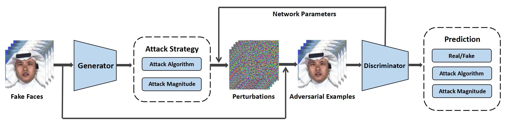
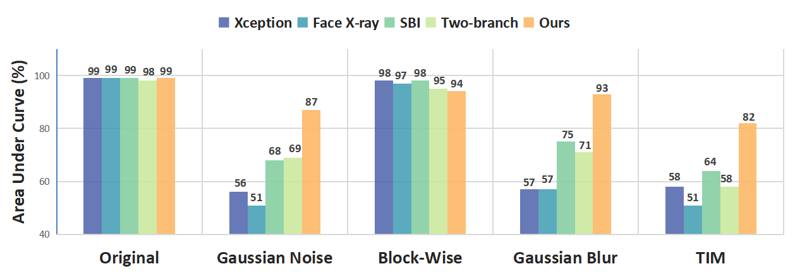

# Self-Supervised Adversarial Training for Robust Face Forgery Detection

## Introduction

This is the source code for *Self-Supervised Adversarial Training for Robust Face Forgery Detection.* Our work has been accepted by BMVC 2023. This is the pipeline of our method. 



Quickly get: [[Paper Link](https://papers.bmvc2023.org/0718.pdf)] [[Home Page](https://proceedings.bmvc2023.org/718/)]

## Updates

* [12/2023] Training code released.
* [11/2023] Conference paper released.

## Install

The implementation bases on Python 3.6. The packages needed in this project are shown in requirements.txt. You can install these packages by:

```python
pip install -r requirements.txt
```

## Dataset

We train our model using the [Faceforencis++](https://github.com/ondyari/FaceForensics) dataset. We utilize the first 270 frames of each training video and the first 110 frames of each validation/testing video. The data structure is like:

    |---README.md
    |---...
    |---data
    	|---FF-DF
    		|---000
    			|---0000.png  
    			|---0001.png  
    			|---...
    		|---...
    	|---FF-F2F
    	|---FF-FS
    	|---FF-NT
    	|---real
The organization of [DeeperForensics](https://github.com/EndlessSora/DeeperForensics-1.0) dataset is similar to FF++. 

## API

### Training

Start training by:

```python
python train.py --train_batchSize 32 --resolution 256 --nEpochs 10
```

There are different settings for your training process, such as batch size, resolution, distributed training, etc.  Check train.py for more augments. 

### Testing

Test the model on FF++.

```python
python test.py --test_batchSize 32 --resolution 256 --pretrained 'the weight of pretrained discriminator'
```

## Result

### **Robustness to Compressed Images**

|  Methods   |    RAW    |    HQ     |    LQ     |
| :--------: | :-------: | :-------: | :-------: |
|  Xception  |   0.989   |   0.961   |   0.895   |
| Face X-ray |   0.988   |   0.866   |   0.631   |
|    SBI     | **0.994** |   0.950   |   0.903   |
| Two-branch |   0.981   |   0.958   |   0.890   |
|    Cvit    |    ---    |   0.937   |    ---    |
| SAT(ours)  |   0.992   | **0.988** | **0.934** |

### **Robustness to Perturbed Images**



More details about these experiments can be found in Section 4 of our paper. 

## Citation

If you find this work useful for your research, please kindly cite our paper:

```late
@article{gao2023self,
  title={Self-Supervised Adversarial Training for Robust Face Forgery Detection},
  author={Gao, Yueying and Lin, Weiguo and Xu, Junfeng and Xu, Wanshan and Chen, Peibin},
  year={2023}
}
```

